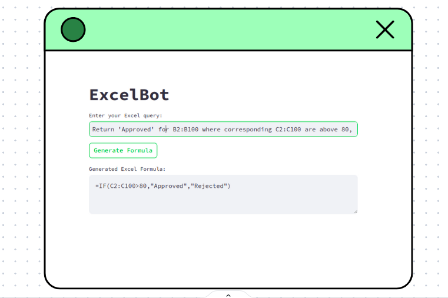

# ExcelBot: Your AI powered spreadsheet assistant.

## Description:
ExcelBot is an AI-powered tool designed to generate accurate Excel formulas based on your queries. Developed by Ansh Gupta, this bot uses advanced language models to understand your needs and provide precise formulas without any extra documentation. Just input your Excel query, and ExcelBot will deliver the right formula, saving you time and enhancing your productivity. Whether for complex data manipulations or simple calculations, ExcelBot is your go-to solution for all your Excel formula needs.

## To-Do
- [ ] Script Generator AI: VBA, Apps Scripts, and Airtable Scripts
- [ ] SQL Query Generator AI
- [ ] Regex Generator AI
- [ ] Template Generator AI
- [ ] Adding support for Google Sheets and Airtable.
- [ ] Extensions for Excel and Google Sheets.

# Contributor Guidelines

Thank you for your interest in contributing to ExcelBot! We welcome contributions of all kinds, including bug reports, feature suggestions, code contributions, and documentation improvements. Please follow these guidelines to help us keep the project organized and ensure a smooth collaboration.

## How to Contribute

### Reporting Bugs
1. Check the existing issues to see if your bug has already been reported.
2. Open a new issue and include a clear and descriptive title.
3. Provide as much detail as possible about the bug, including steps to reproduce, expected behavior, and actual behavior.
4. Include any relevant screenshots or error messages.

### Suggesting Features
1. Check the existing issues to see if your feature has already been suggested.
2. Open a new issue and include a clear and descriptive title.
3. Describe the feature and explain why it would be useful.

### Code Contributions
1. Fork the repository and create your branch from `main`.
2. If you have added code that should be tested, add tests.
3. Ensure the code adheres to the project's coding style and conventions.
4. Commit your changes with clear and descriptive messages.
5. Push your branch to your forked repository.
6. Open a pull request and provide a detailed description of your changes.

## Getting Started
1. Clone the repository: `git clone https://github.com/your-username/excelbot.git`
2. Install the required dependencies: `pip install -r requirements.txt`
3. Run the application locally: `streamlit run app.py`

## Contact
If you have any questions or need further assistance, please open an issue or reach out to the maintainers.
